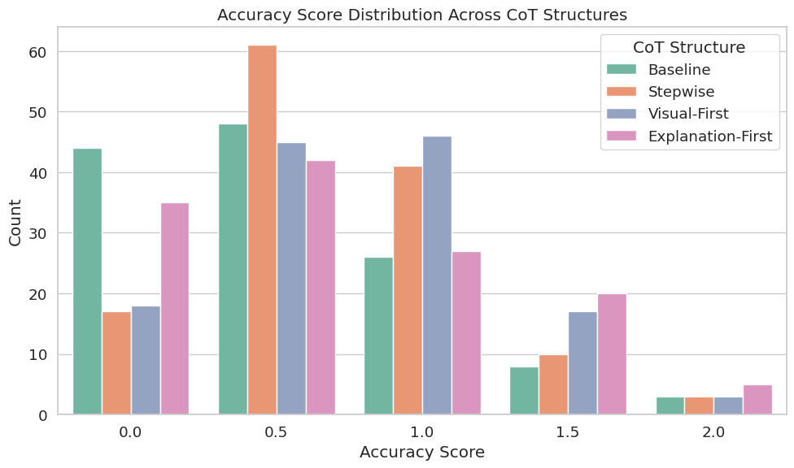
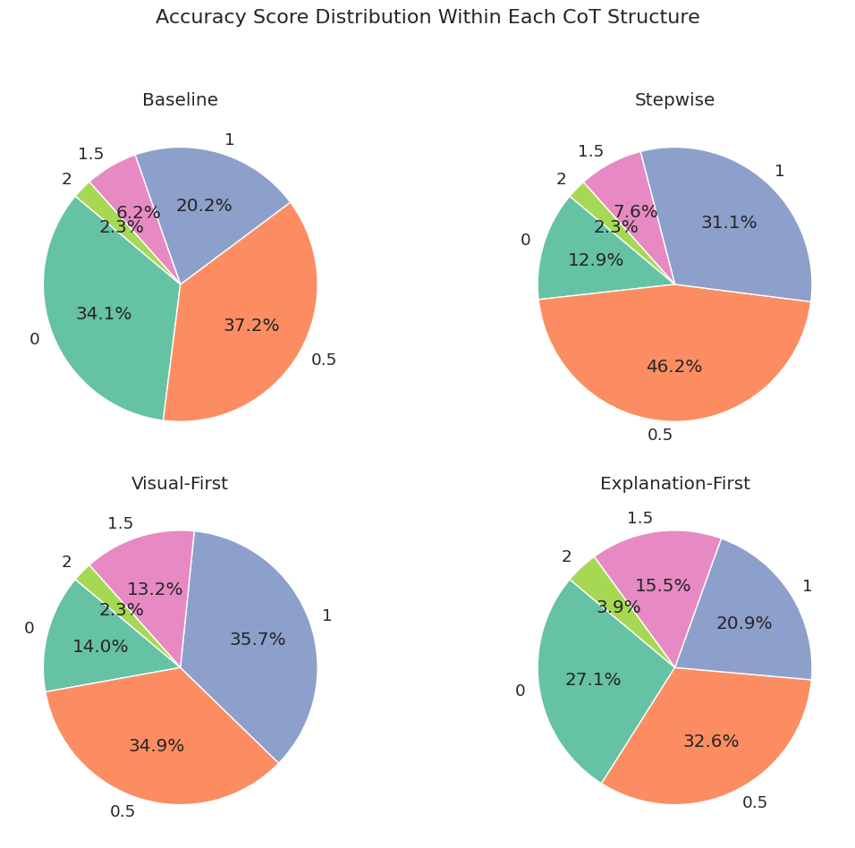
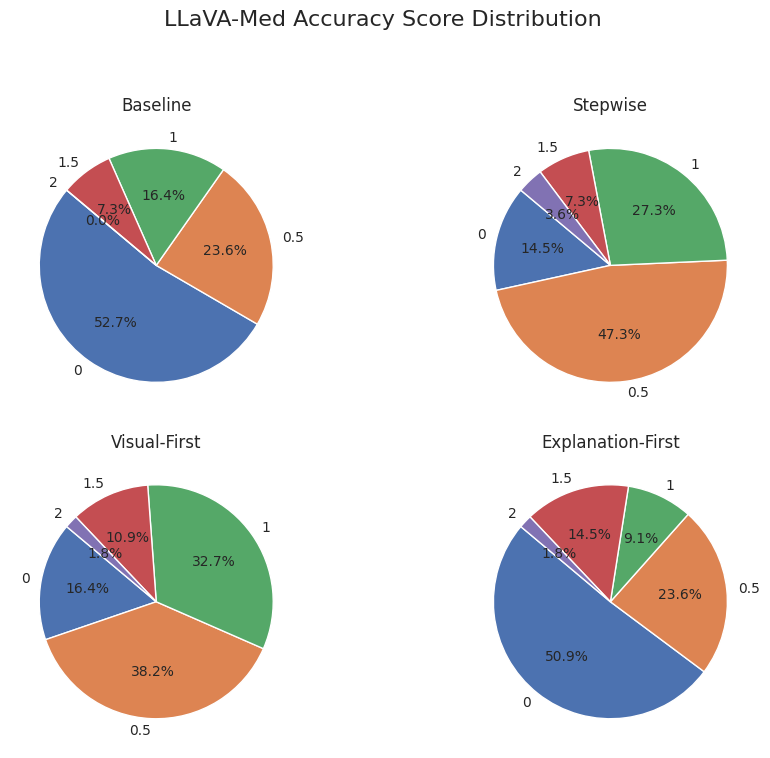
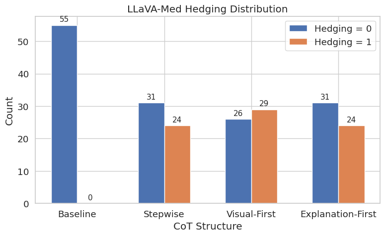
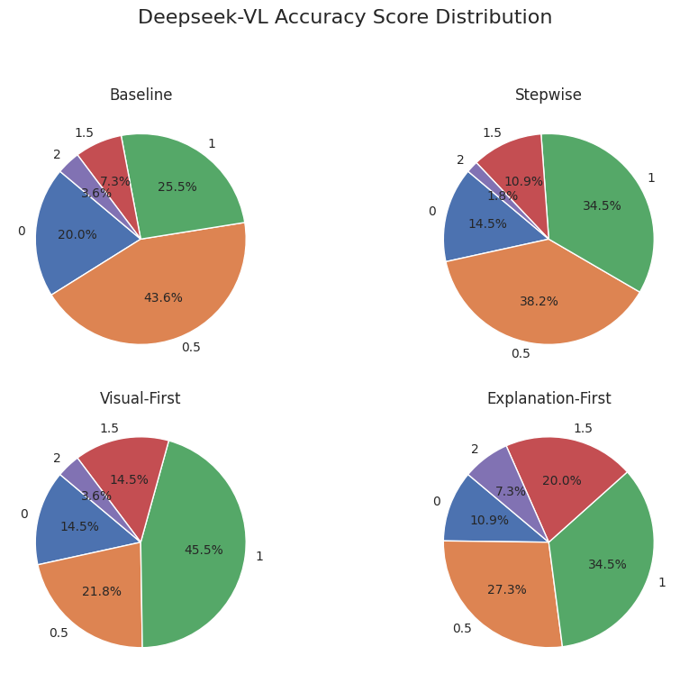
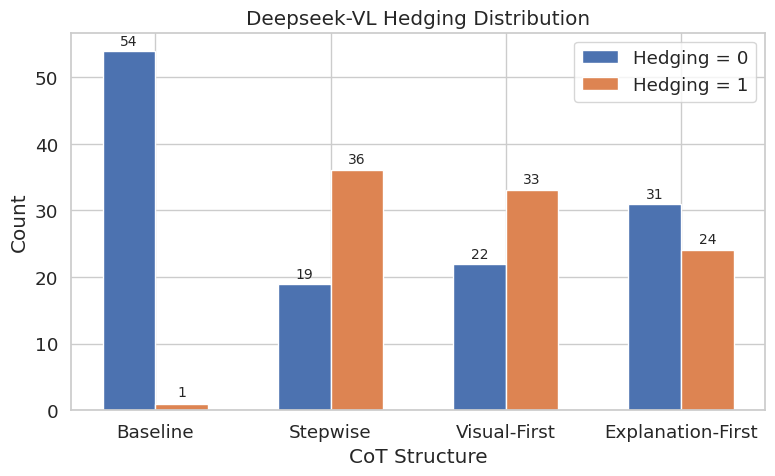

## Task 0  Analysis

### Task 0 Description

The goal of Task 0 is to identify the chemical compound depicted in an image. In other words, the baseline version of the task is framed as a simple question: “What is this molecule?”

The experimental dataset consists of 55 images, covering a range of chemical substances from simple molecules like water and carbon dioxide to more complex compounds such as caffeine, ibuprofen, and nicotinamide. All images were sourced from the Wikimedia Commons chemical image repository to ensure publicly available and standardized materials.

The experiments were primarily conducted using the DeepSeek-VL and LLaVA-Med models, both of which were tested on the full set of 55 images. Additionally, the LLaVA-OneVision model was tested on a subset of 19 images, serving as supplementary validation for the findings from the first two models.

The study compares the baseline outputs with the results generated under different Chain-of-Thought prompting strategies — specifically, stepwise, visual-first, and explanation-first approaches. The outputs were evaluated through human assessment (as well as BLEU scores) to determine how well each CoT strategy supports molecular structure recognition in images.

### Human Evaluation

Human evaluation is important in this project because the task is to identify the molecular formula or chemical structure from an image. Common metrics such as BLIPScore and CLIPScore can only evaluate the alignment between the text and the image but cannot effectively assess whether the chemical knowledge expressed in the output text is scientifically accurate or correct. Therefore, introducing human evaluation is essential, and ideally, the evaluators should have a background in chemistry.

#### Standard

The evaluation dimensions include:

- Accuracy
  Assess whether the output correctly identifies the molecule or key chemical structures — specifically, whether it correctly names the chemical substance or type, whether it recognizes key structures and features in the image (such as functional groups, connectivity, etc.), and whether it explicitly points out the molecule’s name, function, or class.

- Hedging

  Evaluate whether the language expresses appropriate uncertainty (e.g., using words like *may*, *likely*, *suggested to be*), instead of making absolute but potentially incorrect claims. The hedging score is important because when the output is incorrect, using uncertainty expressions is considered better than making confidently wrong statements. This reflects the model’s ability to communicate its uncertainty, which is crucial in scientific contexts.

##### Scoring table

|          | 0                                      | 0.5                                                          | 1                                                            | 1.5                                                          | 2                                                            |
| -------- | -------------------------------------- | ------------------------------------------------------------ | ------------------------------------------------------------ | ------------------------------------------------------------ | ------------------------------------------------------------ |
| Accuracy | Completely wrong                       | Recognizes only a few atoms or fragments, but misidentifies the molecule | Identifies some key structures, but the final result is wrong | Identifies most key structures, but the final result is wrong | Provides the correct analysis name and points out key structure names |
| Hedging  | Strongly certain language (no hedging) | /                                                            | Uses expressions of uncertainty                              | /                                                            | /                                                            |

##### Example scoring

**Example1**

Output: 

> [Visual-First CoT] The molecule is likely a steroid, which is a type of organic compound. Steroids are characterized by their unique structure, which includes a core of four interconnected rings. The presence of a hydroxyl group (OH) in the molecule may also be a clue to its identity. However, without more specific information, it is difficult to determine the exact type of steroid or its specific function.

Score:

- Accuracy $\to$ 1.5
  Correctly identifies the “steroid” framework and hydroxyl group (OH); although it does not name cortisol specifically, the general direction is right; mentions steroid structure and OH group but misses details like ketone or carboxyl groups.
- Hedging $\to$ 1
   Uses words like *likely*, *however, without more specific information* to express uncertainty.

**Example2**

Output:

> [Baseline] This molecule is a 2-nitrobenzaldehyde, which is a chemical compound. It is a derivative of benzaldehyde, where one of the hydrogen atoms has been replaced by a nitro group.

Score:

- Accuracy $\to$ 0.5
  Although it incorrectly identified the molecule as 2-nitrobenzaldehyde, it at least recognized the nitro group and the benzene ring.
- Hedging $\to$ 0
  Makes a direct assertion.

### Analysis Across Different CoT Structures

The dataset contains a total of 55 images. For the DeepSeek-VL and LLaVA-Med models, inference was completed on all 55 images. For the LLaVA-OneVision model, inference was selectively performed on 19 of the images. For each image, every model produced four types of outputs, corresponding to the four CoT structures: baseline, stepwise, visual-first, and explanation-first.

In total, this resulted in $55 \times 2 + 19 = 129$ inference runs across all CoT structures.

The summary of the evaluation scores is as follows:

| accuracy score | baseline | stepwise | visual-first | explanation-first |
| -------------- | -------- | -------- | ------------ | ----------------- |
| 0              | 44       | 17       | 18           | 35                |
| 0.5            | 48       | 61       | 45           | 42                |
| 1              | 26       | 41       | 46           | 27                |
| 1.5            | 8        | 10       | 17           | 20                |
| 2              | 3        | 3        | 3            | 5                 |

By observing the statistical results, we can see that overall, accuracy scores of 0.5 or 1 are the most common. This indicates that the models were often able to identify part of the atoms or key structures in the images but still partially failed in recognition. At the same time, using CoT indeed helps improve image recognition. Although the number of cases where the correct molecular name was fully identified (i.e., perfect scores) does not differ significantly between the baseline and CoT approaches, the likelihood of receiving a score of 0 is greatly reduced. Specifically, the baseline model received a score of 0 in 34% of the cases, whereas with CoT, the highest proportion of 0 scores was no more than 27.1%.

If we look deeper into the contributions of different CoT structures to the final results, we find that stepwise achieves the highest overall success rate (i.e., nonzero scores), followed by visual-first, with explanation-first performing the lowest overall. While stepwise has the highest success rate, nearly 50% of its scores are 0.5, meaning it often only captured a few atoms or marginally relevant details. In contrast, visual-first shows a more balanced score distribution, with 70.6% of its scores falling in the 0.5–1.0 range, and it also performs well in the high-score ranges (1.5 and 2.0), outperforming stepwise in this aspect. Explanation-first, meanwhile, is less stable: although it achieves the highest proportion of high scores (1.5 and 2.0) among all CoT structures, at 19.4%, it also has the highest proportion of 0 scores — twice that of stepwise and visual-first.

In summary, using Chain-of-Thought improves the ability to identify chemical substances in images, and visual-first may be the best choice among the CoT structures, offering both high overall success rates and a relatively strong chance of achieving near-perfect answers, only about 4 percentage points below explanation-first. The choice between stepwise and explanation-first depends on user preference — whether one prioritizes stable partial recognition or a relatively higher chance of perfect recognition.

### Analysis across different model

We attempted to conduct a deeper analysis of the three models to examine the detailed performance data, aiming to assess whether the accuracy scores for the baseline and different CoT structures remain stable across models, whether certain CoT structures are better suited for specific models, and to analyze the differences between the models to see if any clear advantages or disadvantages emerge among these three ~7B models on Task 0.

#### LLaVA-Med

By observing the statistical results, we can see that the accuracy score distribution for LLaVA-Med closely resembles the overall trends discussed in the previous section — using CoT structures generally helps improve the scoring rate. However, the performance of the explanation-first structure on LLaVA-Med diverges noticeably from the aggregated results: although its high-score rate (1.5/2) remains the highest among the three CoT approaches, its zero-score rate is nearly the same as the baseline, exceeding 50%, making it highly unstable. A possible explanation is that the explanation-first prompts require the model to elaborate on background chemical knowledge upfront, increasing prompt length and potentially compromising output quality, often yielding shorter and less complete responses. Moreover, the model may exhibit recency or positional bias, focusing on earlier input at the expense of critical task instructions later in the prompt, thereby adversely affecting performance.

Stepwise achieves the highest overall score rate but mostly in the lower score bands. Visual-first continues to perform the best, achieving a high score rate, stable results, and good representation in the high-score bands.

Looking at the hedging scores, we can see that using CoT structures increases the use of uncertainty expressions, improving the scientific rigor of the output. In contrast, baseline outputs were all deterministic statements; combined with a high zero-score rate, this suggests lower text quality (i.e., confidently outputting incorrect identifications). CoT structures enable the generation of non-assertive language to some extent, with little difference between structures, though visual-first performs slightly better overall.

In summary, LLaVA-Med’s overall performance is relatively poor, with a lower score rate compared to the aggregated results of other models. However, the visual-first structure consistently maintains good performance, making it the overall best among the CoT approaches and roughly matching the combined results. Stepwise ranks second, while explanation-first performs poorly on this particular model.

#### DeepSeek-VL

Compared to LLaVA-Med, the DeepSeek-VL model demonstrates significantly better overall performance. First, even the worst-case scenario — baseline — only has a 20% rate of zero scores, already a substantial improvement. More importantly, all CoT prompting strategies show increases in the proportion of high scores (1.5 or 2.0), indicating stronger capabilities in recognizing chemical structures under guided reasoning.

The stepwise structure shows a slightly lower proportion of 0.5 scores on DeepSeek-VL compared to other models, yet it still ranks the lowest overall among the three CoT approaches. In contrast, visual-first maintains consistently strong performance, with both a solid non-zero score rate and a reliable representation in the high-score bands. Its stability across models and score ranges reinforces its strength as a general-purpose CoT strategy.

Notably, the explanation-first structure performs especially well on DeepSeek-VL. It achieves the highest proportion of high scores (1.5 and 2.0) while also maintaining the lowest proportion of zero scores among all CoT structures on this model. This suggests that DeepSeek-VL is particularly well-suited to handling long-form prompts and complex explanations, likely due to its stronger instruction-following capabilities and reduced sensitivity to input length. Unlike LLaVA-Med, which may suffer from prompt truncation or positional bias, DeepSeek-VL appears able to retain task context and process detailed reasoning effectively throughout the prompt.

Looking at the hedging scores, similar to LLaVA-Med, we can conclude that using CoT structures increases the use of uncertainty expressions.

In summary, explanation-first emerges as the best-performing CoT structure on DeepSeek-VL, resolving the instability (high zero-score rate) observed in other models. Visual-first remains a strong runner-up, achieving the highest non-low-score (1.0 and above) rate across the board. This suggests that DeepSeek-VL benefits from both detailed reasoning and visual pattern matching, and is robust to different prompt designs when paired with well-structured CoT strategies.

#### LLaVA-OneVision

### Additional Analysis

#### Comparison between Condensed/Skeletal Formula